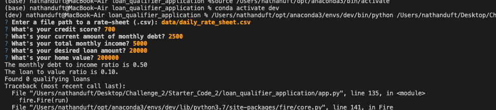

# Loan Qualifier Application - Challenge 2

The is a command-line interface application for saving users qualifying loans in a new CSV file. 

---

### Technologies

This project leverages python 3.7.10 with the following packages.

questionary- For interactive user prompts and dialogs
fire- For interactive user prompts and dialogs

### Installation Guide

In this section, you should include detailed installation notes containing code blocks and screenshots.
* >pip install fire
* >pip install questionary
* >import csv
* >from pathlib import Path
* >pip install pytest

---

### Examples

Enter csv path. User will enter loan specifications and ratios to see what loans will be available. Saved in output folder.

---

### Usage

To use this project enter your information after runing python app.py
---

### Contributors

Nathan Duft
nathan.duft@gmail.com
nathanduft44
---

### License

afl-3.0
